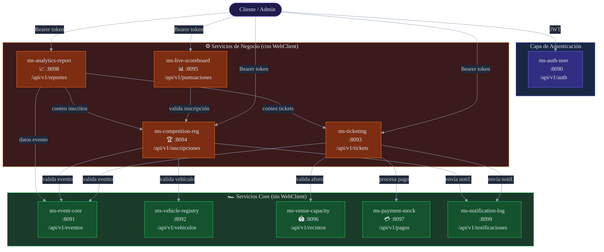
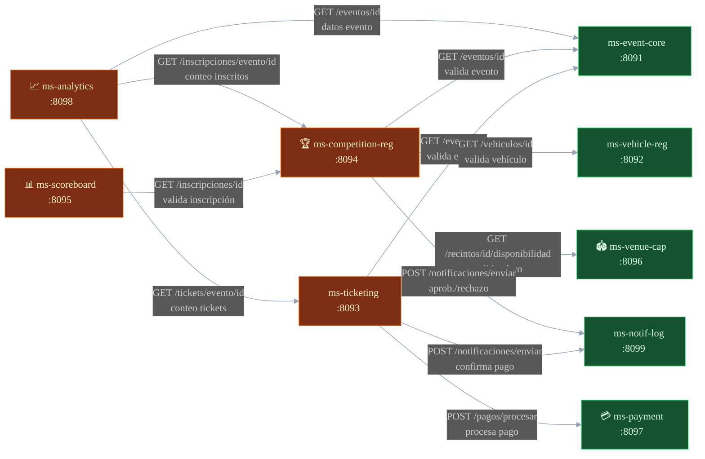
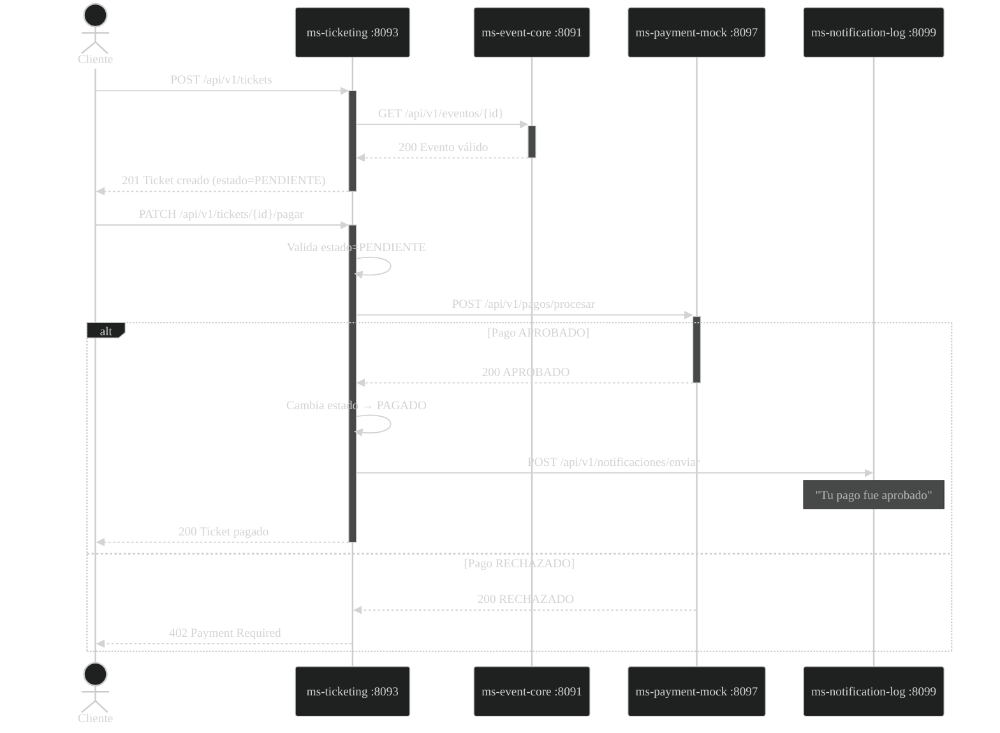
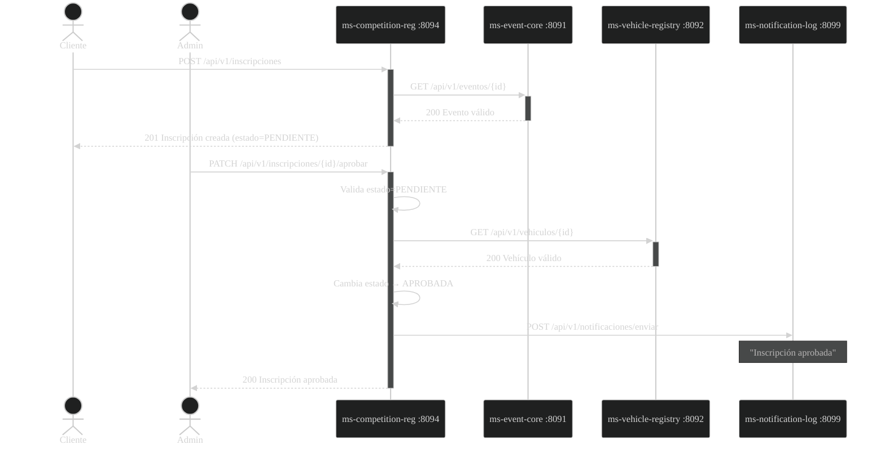
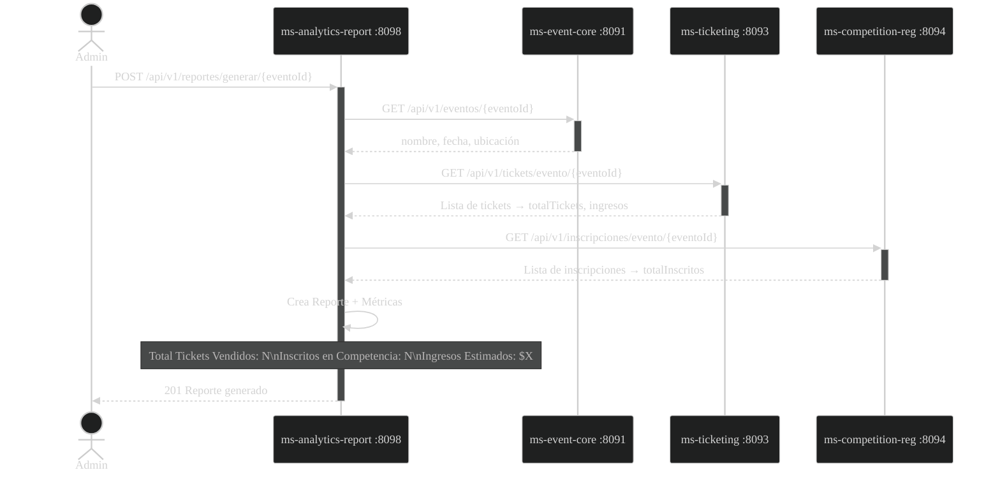
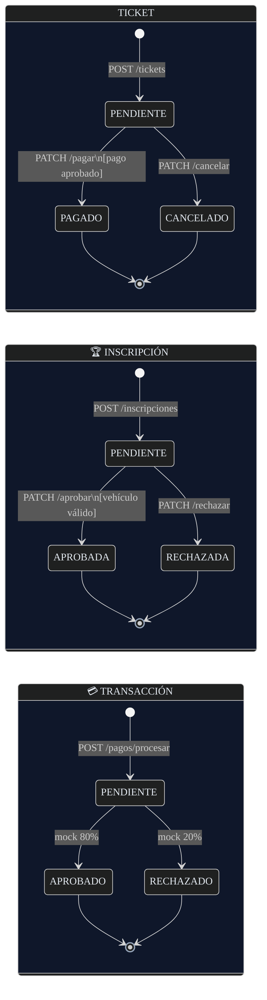
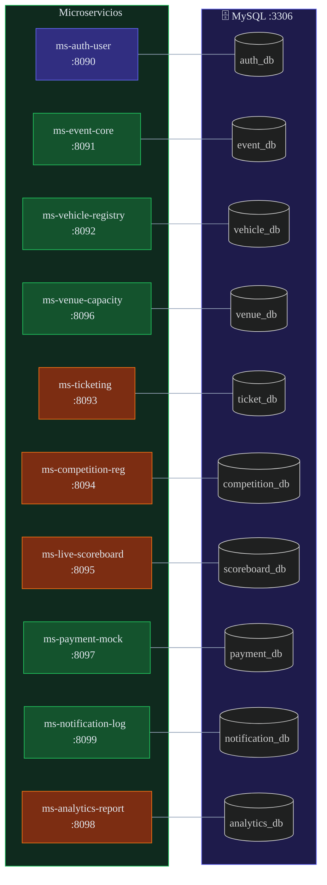
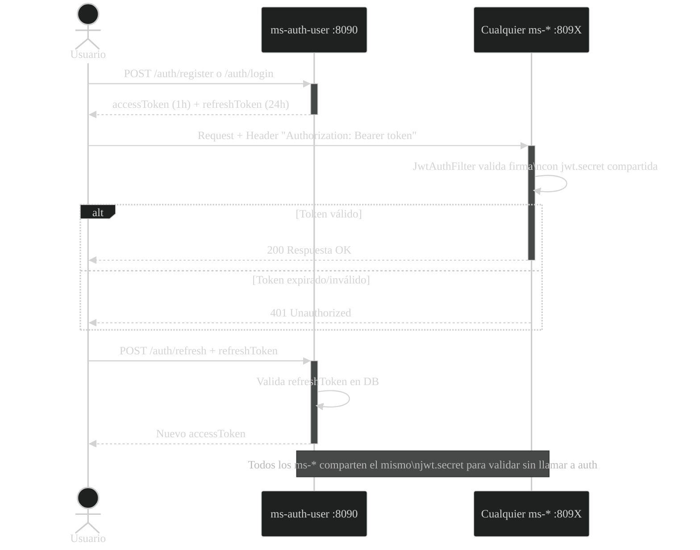
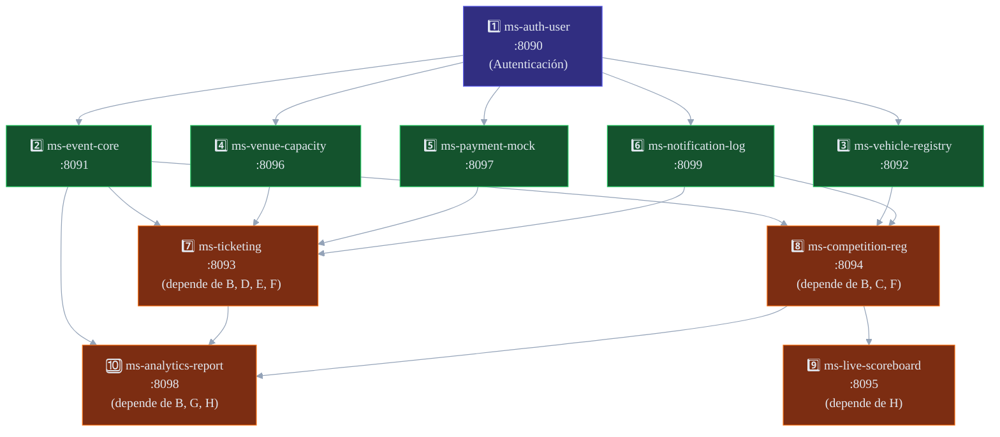

# 📊 CarMeet — Diagramas de Arquitectura y Diseño

> Diagramas para uso en diapositivas y documentación técnica.

---

## 1. Arquitectura de Microservicios — Diagrama C4 / Componentes

---

## 2. Diagrama Entidad-Relación Global (Lógico)

```mermaid
%%{init: {'theme': 'dark', 'themeVariables': {'primaryColor': '#1e3a5f', 'primaryTextColor': '#e2e8f0', 'lineColor': '#94a3b8', 'background': '#0f172a', 'fontFamily': 'Segoe UI, sans-serif'}}}%%
erDiagram
    USUARIO {
        bigint id PK
        varchar username
        varchar password
        varchar role
    }
    REFRESH_TOKEN {
        bigint id PK
        varchar username FK
        varchar token
        datetime expiry_date
    }
    EVENTO {
        bigint id PK
        varchar nombre
        varchar fecha
        varchar ubicacion
    }
    PATROCINADOR {
        bigint id PK
        varchar nombre
        varchar nivel
        bigint evento_id FK
    }
    RECINTO {
        bigint id PK
        varchar nombre
        int capacidad_maxima
        int ocupacion_actual
    }
    ZONA {
        bigint id PK
        varchar nombre
        int capacidad
        int ocupacion
        bigint recinto_id FK
    }
    VEHICULO {
        bigint id PK
        varchar marca
        varchar modelo
        int anio
    }
    MANTENIMIENTO {
        bigint id PK
        varchar descripcion
        bigint vehiculo_id FK
    }
    TICKET {
        bigint id PK
        bigint evento_id
        double precio
        varchar categoria
        varchar estado
        varchar username
    }
    BENEFICIO {
        bigint id PK
        varchar nombre
        varchar descripcion
        bigint ticket_id FK
    }
    INSCRIPCION {
        bigint id PK
        bigint vehiculo_id
        bigint evento_id
        varchar participante
        varchar categoria
        varchar username
        varchar estado
    }
    REQUISITO {
        bigint id PK
        varchar nombre
        varchar descripcion
        bigint inscripcion_id FK
    }
    PUNTUACION {
        bigint id PK
        bigint inscripcion_id
        bigint evento_id
        int puntos
    }
    DETALLE_PUNTUACION {
        bigint id PK
        varchar categoria
        int puntos_asignados
        varchar descripcion
        bigint puntuacion_id FK
    }
    PAGO {
        bigint id PK
        bigint ticket_id
        double monto
        varchar metodo_pago
    }
    TRANSACCION_LOG {
        bigint id PK
        varchar estado
        datetime fecha
        bigint pago_id FK
    }
    NOTIFICACION {
        bigint id PK
        varchar destinatario
        text mensaje
        boolean leida
    }
    ADJUNTO {
        bigint id PK
        varchar nombre_archivo
        varchar url
        varchar ruta_archivo
        bigint notificacion_id FK
    }
    REPORTE {
        bigint id PK
        int total_eventos
        varchar fecha_generacion
        bigint evento_id
        int total_tickets
        int total_inscripciones
    }
    METRICA {
        bigint id PK
        varchar nombre
        double valor
        bigint reporte_id FK
    }

    USUARIO ||--o{ REFRESH_TOKEN : "tiene"
    EVENTO ||--o{ PATROCINADOR : "tiene"
    RECINTO ||--o{ ZONA : "tiene"
    VEHICULO ||--o{ MANTENIMIENTO : "tiene"
    TICKET ||--o{ BENEFICIO : "tiene"
    INSCRIPCION ||--o{ REQUISITO : "tiene"
    PUNTUACION ||--o{ DETALLE_PUNTUACION : "tiene"
    PAGO ||--o{ TRANSACCION_LOG : "genera"
    NOTIFICACION ||--o{ ADJUNTO : "tiene"
    REPORTE ||--o{ METRICA : "tiene"
```

---

## 3. Mapa de Comunicación WebClient (Flujos de Llamadas)

---

## 4. Flujo de Negocio — Compra de Ticket

---

## 5. Flujo de Negocio — Inscripción a Competencia

---

## 6. Flujo de Negocio — Generación de Reporte Analytics

---

## 7. Ciclos de Vida de Entidades (State Machine)

---

## 8. Mapa de Puertos y Bases de Datos

---

## 9. Arquitectura de Seguridad JWT

---

## 10. Orden de Arranque Recomendado

